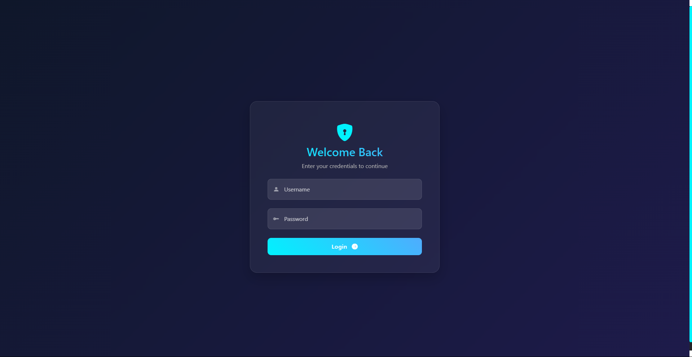
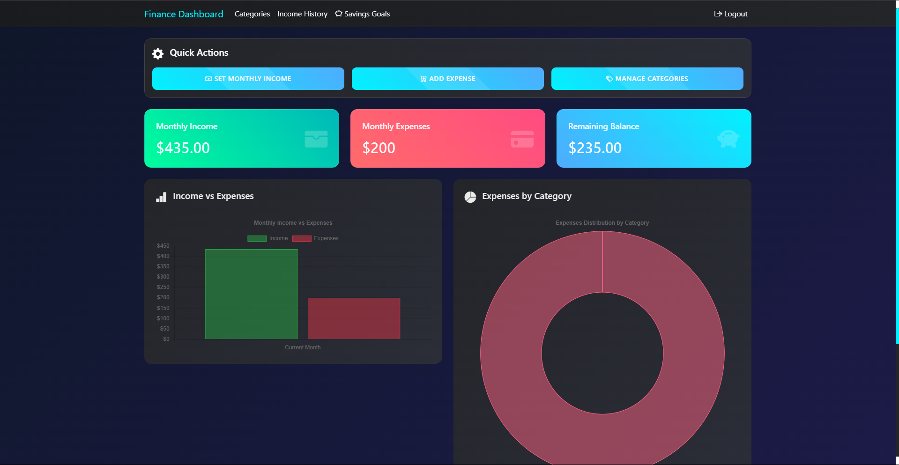
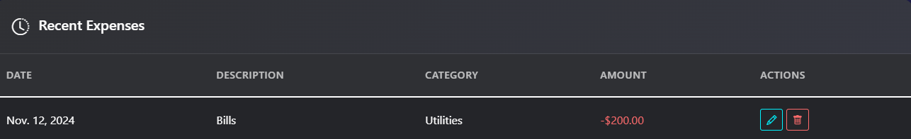
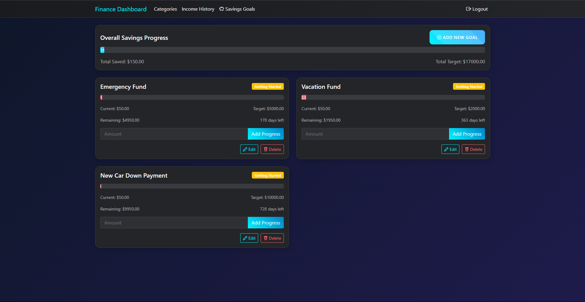

# Personal Finance Dashboard 💰

A modern, feature-rich personal finance management system built with Django that helps users track their income, expenses, and savings goals with an intuitive dashboard and beautiful visualizations.

## Features ✨

- **Secure Authentication System** 🔐
  - User registration and login
  - Protected routes
  - Secure session management

- **Dashboard Overview** 📊
  - Monthly income and expenses summary
  - Interactive charts and graphs
  - Real-time balance calculations
  - Expense category distribution visualization

- **Income Management** 💵
  - Set monthly income
  - Track income history
  - Multiple income sources support

- **Expense Tracking** 📝
  - Add and categorize expenses
  - Edit/Delete transactions
  - Category-wise expense analysis
  - Recent transactions list

- **Savings Goals** 🎯
  - Set and track savings goals
  - Progress visualization
  - Target date tracking
  - Default savings goals templates

- **Category Management** 📑
  - Custom expense categories
  - Pre-defined category templates
  - Category-wise expense analysis

## Screenshots 📸

### Login Page

### Dashboard

### Expense Management

    
### Savings Goals

## Technology Stack 🛠️

- **Backend**: Django 4.1
- **Frontend**: HTML5, CSS3, JavaScript
- **Database**: SQLite (default)
- **Charts**: Chart.js
- **UI Framework**: Bootstrap 5
- **Icons**: Bootstrap Icons

## Installation 🚀

1. Clone the repository 

## Demo Credentials and Website URL
Username: admin
Password: admin123
Live: https://finance-dashboard-s4pv.onrender.com/login/
